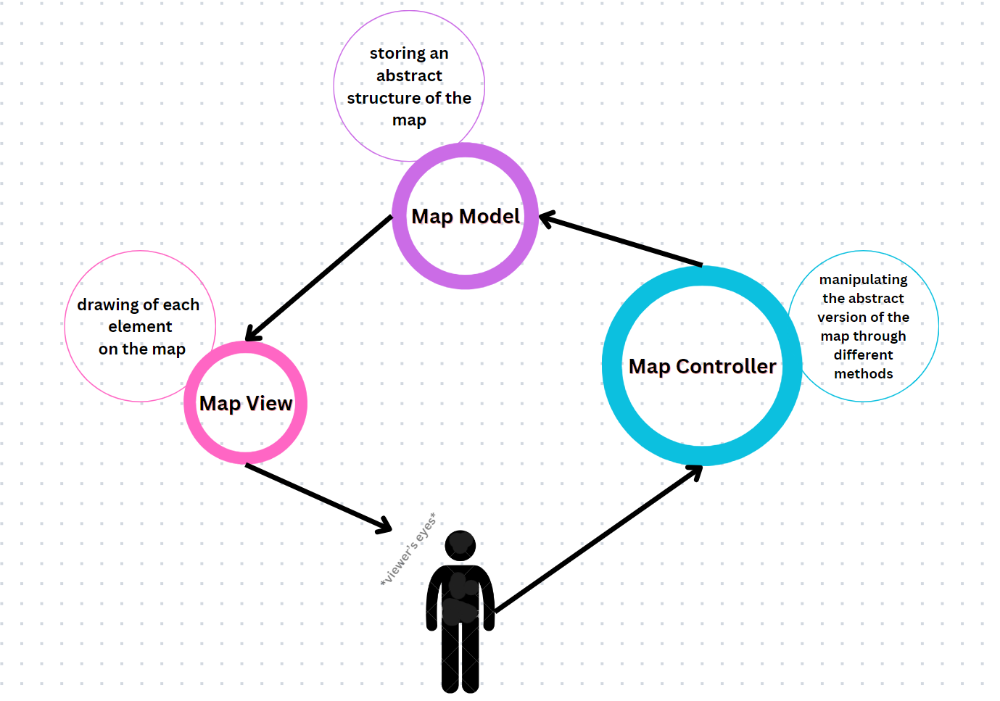

# Report

Vitalik Sikorski (s5622360) & Vlad George Coicea (s5562465)

## Introduction

Our Program creates the RTS Game, a Lord of the Rings-themed battle simulator, which basically lets the user create an environment suitable for battling and creating startegies in order to get the Team of "Good Guys" to win the Game. In a nutshell, the game provides the User with a editable map that can be accessed and modified, providing the user with the ability to create a desired field for battling. The implementation of this whole idea is based on the Model-View-Controller (MVC) architectural pattern, enhancing modularity and maintainability while ensuring a user-friendly experience through intuitive graphical interfaces.

## Program design

As I previously stated, the program follows the MVC pattern, ensuring a well organised coding environment, well suited for this type of complex projects. We will discuss the program design focusing on each one of the three categories.

The controller package handles user input and updates the model accordingly. The main controller is the map controller class, which coordinates the interactions between the model and the user input. It includes methods for handling changes in nodes and edges, adding and removing elements, and updating the model accordingly. Additional controllers, such as the mouse controller and the click validator, help with specific functionalities like mouse event handling and capturing the clicks done by the user. We separated these two from the main controller because it handles a heavier side of the code that is essential and should not be changed, unless required. The other two, the side panel controller and the tool bar controller, contain methods that modify the UI such that the user receives access to all the functions in the game.

The model package represents the core data and logic of the application. It includes the classes for the graph components: Node, Edge, Army and Event; as well as the subclasses(factions) of the army class, keeping it organised, clear and easy to read. We thought that having a class for each faction type would be more efficient when reading and modifying the program, following the polymorphism principle that lets us apply the same method to all army types, but personalised according to the needs of each faction. The map model class is central to the model, storing the collection of abstract elements in one place, and maintaining the state of the map. Also, the tool bar model is there to keep track of the state of each tool bar button, referring to the map model.

Finally, the view package is responsible for the graphical user interface (GUI). The main view component is the map view class, which provides the visual representation of the graph. It includes methods for drawing all the graph's components, as well as handling the active change in the map. The view updates dynamically based on changes in the model, ensuring a responsive and interactive experience. Our approach regarding the view was pretty straight forward, drawing all the elements needed for representing the graph, in the desired order. Besides the map view, there are also the side panel view and the tool bar view, which help the user edit the map, without having to write code. Both interact with the user according to what is happening in the game, providing him with various functions and ways of personalizing the game environment.

## Evaluation of the program

The implementation of the program demonstrates stability and functionality, with the core features performing as expected. However, there are areas for potential improvement because some limitations were encountered. The program handles in an effective manner user interactions, allowing for intuitive manipulation of the graph through clicks and drags. The view component of the program updates successfully in response to changes in the model. Whenever a node or edge is added, removed, or modified, the view refreshes to reflect these changes immediately. This dynamic update mechanism ensures that the user interface remains consistent with the abstract data, offering real-time feedback and enhancing the overall usability of the application. The use of the MVC pattern, helper classes like ClickValidator and MouseController and the Observer and Observable interfaces  the modularity and maintainability of the code.

Regarding the problems with our program, as the size of the graph increases, the performance of the program can degrade. Operations such as rendering the graph and handling user interactions become slower, which can affect the user experience. This is particularly noticeable with very large graphs, where the complexity of the operations involved strains the program's efficiency. The current user interface, while functional, could benefit from improvements in aesthetics and usability. More informative tooltips, better visual indicators for selected elements, and a more polished look would make the application more appealing and easier to use. Additionally, providing better feedback for invalid operations would improve the overall user experience.

The code has been tested to a reasonable extent, with the core functionalities verified through manual testing. Moreover, loads of edge cases and functionalities outside the tools provided for the UI were also checked manually, preparing the grounds for future developments.

The program demonstrates a solid implementation of a graph-based map management system using the MVC pattern. While the core functionalities and the modular design are well done, there are areas for enhancement, particularly in terms of edge case handling, performance optimization, and user interface improvements.

## Questions

Please answer the following questions:

1. In this assignment, the program should follow the Model View Controller (MVC) pattern. Please explain the design of the program in terms of the MVC pattern. Specifically try to answer the following questions:
   - MVC consists of three components: Model, view and controller. Can you please explain the role of each component? Please provide examples of these roles from the assignment. How are these three roles (i.e. Model, view and controller) are implemented in the assignment?
   - MVC enforces special constraints on the dependencies between its three components: Model, view and controller. Please explain these constraints, and why are they important?

___

Answer:

The model represents the core data and logic of the application. In this program, the model includes classes such as the MapModel. The MapModel class is pivotal, managing the collection of nodes and edges, handling the creation, deletion and state management of these elements. For example, when a user adds a new node, the MapModel updates its internal data structure to include this new node.

The view is responsible for displaying the data to the user and presenting the user interface (UI). The MapView class in this program is the primary view component, which visually represents the graph. It handles rendering the graph and updating the display in response to changes in the model. For instance, when a new node is added in the graph, the MapView redraws it with the new node. The view directly interacts with the model to fetch data but does not modify it.

The controller handles user inputs and converts them into actions that can be executed by the model. The MapController class acts as the main controller, coordinating the interactions between the model and the user input. For example, when a user clicks to add a node, the MapController updates the MapModel to generate the new abstract representation of the game.

In the MVC pattern, the view depends on the model to display data but does not alter it. The controller updates the model, maintaining the integrity of the data. The model does not directly depend on either the view or the controller, promoting decoupling and modularity.

___

2. The Swing library provides the ability to create nested user interface components. In this assignment, you created multiple JPanel components on the user interface. These contain other user interface components to build-up a tree of user interface components.
Which design pattern does Swing implement to create a hierarchy of user interface components? Please explain this pattern and how it is implemented in Swing.

___

Answer:

Swing uses the composite design pattern to create a hierarchy of UI components. This pattern allows individual components to be composed into more complex structures, forming an abstract tree. Each component in this hierarchy can contain other components, enabling the creation of nested UI elements.

In the context of this program, multiple JPanel components are used to build the UI. Each JPanel can contain other components such as buttons, labels, or additional panels, creating a hierarchical structure. For example, the main two main panels that allow the user to interact with the map, the top and the side panel, create a base upon which many buttons and labels sit, having with different roles and functionalities related to this application.

The composite pattern works by treating both individual objects and compositions of objects uniformly. Each component in the composite can be treated as a JComponent, allowing for flexible and recursive composition of UI elements. This enables complex UIs to be constructed in a modular and reusable manner.

___

3. The Observer pattern is useful to implement the MVC pattern. Can you please explain the relationship between the Observer pattern and the MVC pattern?
Please provide an example from the assignment on how the Observer pattern supports implementing the MVC pattern.

___

Answer:

The Observer pattern is very useful when implementing the MVC pattern as it facilitates the communication between components. In this pattern, the Model represents the application's data and business logic, the View displays the data, and the Controller manages user input. The Observer pattern allows Views to observe the Model for changes made by the Controller. When the Model's state changes, it notifies all registered observers to update accordingly. This decouples the Model from the Views, promoting a modular architecture where components can be independently developed, tested, and maintained, enhancing flexibility and scalability.

In our project, we implemented the Observer pattern to link the map model to the map, top toolbar and side toolbar views.This way, when the changes occur in the abstract representation of the graph the map updates, the buttons in the top toolbar become available accordingly, and the right panel appears on the side.

___

## Process evaluation

We to work together making sure that the program is buildable on and that is easy to read. Besides the range it provides regarding how much one can improve and create on this code, this principle helped a lot during the process of creating our project. When we started testing the program there were irregularities, but we manage to find out what was going wrong within the code pretty fast.

Some examples of harder challenges we had to deal with were drawing edges and armies, creating the click validators, creating the panels for nodes and edges, and implementing the simulation steps. The easiest parts were regarding the structure of the model package, because the structure of each model is pretty straight forward. Key learnings included the effective use of Swing for GUI development and the importance of modular design for maintainability.

## Conclusions

We believe that we successfully implemented the Lord of the Rings-themed battle simulator using the MVC pattern. Throughout the project, we focused on modularity and maintainability. We designed and tested the application, refining our approach based on user interaction and performance feedback. By addressing complex user interactions and edge case handling, we improved the program’s stability. Overall, we created a functional and interactive application that meets our design goals.
